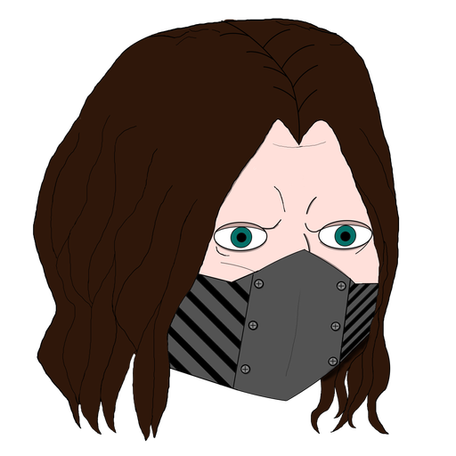

# neoBlog

My new blog; previous blog was Django, and also bad, so I made this one 

If you want to clone it, follow the steps below 

## Installation

1. Clone the repository:
2. Navigate into blog:
3. docker build -t neoblog .
4. docker compose up -d

You are done 
